本文档暂不更新。更多内容请前往：Qt Creator版本[Windows & Linux]：[Leopard-C/iCGIS-Linux](https://github.com/Leopard-C/iCGIS-Linux)

## 一、实习目标

编写底层代码解析GeoJson、借助GDAL读取Shapefile以及连接PostGIS获取数据。使用Qt设计窗口界面，并调用原生OpenGL绘图。在绘图的基础上，读取SLD文件，并应用到所读取的相应图层。同时创建空间索引，优化查询效率。最后，在此基础上，实现核密度分析。

## 二、开发环境

| 配置选项 | 内容                                      |
| -------- | ----------------------------------------- |
| Language | C++(std=c++17)                            |
| IDE      | Visual Studio 2017                        |
| SDK      | Qt 5.12 (x64)                             |
| LIB      | GLEW、glm、GDAL、JsonCpp、pugixml、spdlog |

## 三、技术框架

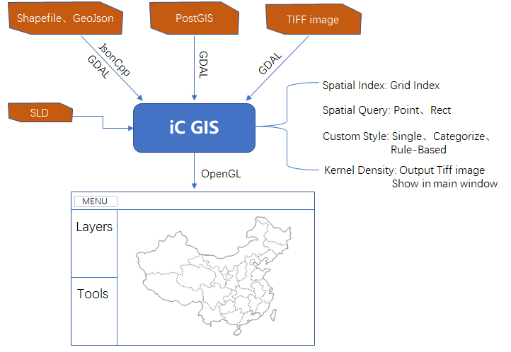

## 四、详细设计

### 1、数据支持

+ ShapeFile：使用GDAL读取
+ GeoJson：借助JsonCpp按照指定格式解析
+ PostGIS：使用GDAL连接并读取
+ TIFF：使用GDAL读取

### 2、UI设计及功能

UI设计全部由代码构建，借助Qt的Layout概念进行界面设计，虽然需要写很多代码，但是更加灵活，需要加添加控件或布局，只需new一个即可，不需要来回切换应用。

#### 2.1 主窗口

主窗口由一个菜单栏、图层管理控件、工具箱控件和OpenGL绘图控件组成。图层管理控件和工具箱控件都继承自QTreeWidget，OpenGL绘图控件继承自QOpenGLWidget。

#### 2.2 图层管理控件

图层管理控件由一个根节点（地图节点）和若干子节点（图层节点）组成。支持如下功能：

+ 双击节点重命名地图或者图层
+ 拖动节点调整图层顺序，实时更新地图显示
+ 显示/隐藏图层
+ 右键：删除图层、缩放至图层、打开属性表、打开符号化窗口、开始/停止编辑

#### 2.3 工具箱控件

工具箱控件目前只有一个核密度分析工具，双击"Kernel Density"节点即可弹出核密度分析工具。

#### 2.4 OpenGL绘图控件

继承自QOpenGLWidget，需要重新initialzeGL、resizeGL和paintGL这三个函数。initialzeGL函数中执行OpenGL的初始化，也包括第三方库的初始化(如GLEW库)。resizeGL函数在窗口大小发生变化时执行。paintGL则是真正执行OpenGL绘图命令的函数，需要重新渲染时不需要直接调用此函数，应该调用update()函数，即可触发图形的重绘。

#### 2.5 连接PostGIS数据库

菜单栏"File->Connect->PostgreSQL"即可弹出数据库连接信息，输入信息后，系统尝试连接，如果连接成功，会弹出另一个窗口，会以表格的形式列出数据库中的所有图层的简要信息，第一列有复选框，勾选要导入的图层，即可导入地图中。

#### 2.6 属性表

用于显示图层的属性表，主要由一个QTableWidget和一个工具条组成。双击每一条记录(要素)前的竖直表头，即可在OpenGLWidget中高亮选中的要素。

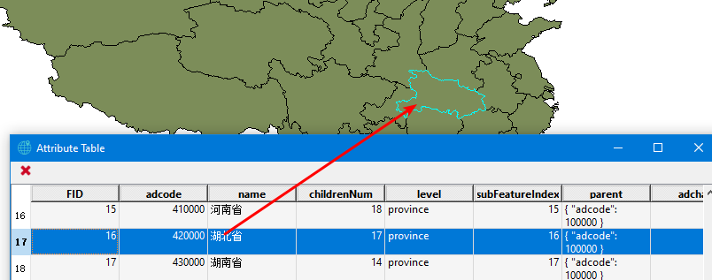

#### 2.7 图层样式设计窗口

支持三种样式，SingleSymbol、Categorized和Rule-Based，选择不同的选项，即可显示相应的设计界面。其中读取SLD后，会跳转到Rule-Based界面。

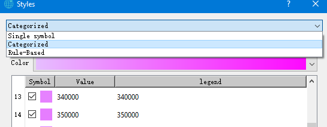

#### 2.8 全局搜索框

支持模糊搜索，智能提示（借助Qt的QCompleter），全局搜索或者指定图层搜索。尝试过使用friso库进行分词，虽然分词效果很好，但是由于地图中加载的图层来源不一，属性表各部相同，很难统一。

没有鼠标焦点时，完全透明显示，且不显示任何按钮。有鼠标焦点时，部分透明显示，并显示clear和search按钮。如下图：

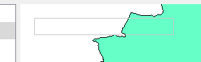

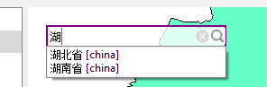

搜索后会弹出一个窗口，由于可能不止一条搜索记录，因此双击相应记录，可以在OpenGLWidget中高亮相应要素。

#### 2.9 日志窗口

点击菜单栏"Window->Log"即可弹出日志窗口。支持日志级别高亮显示。

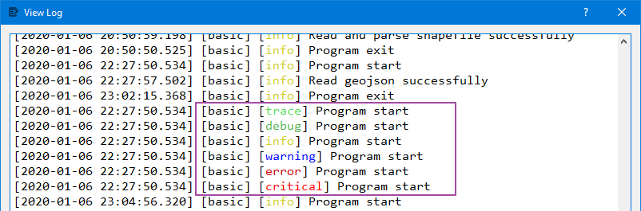

### 3. 程序的关键点实现

#### 3.1 Geometry类

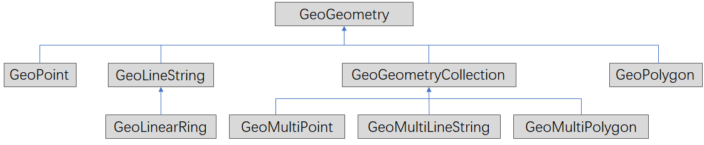

#### 3.2 Map、Layer类

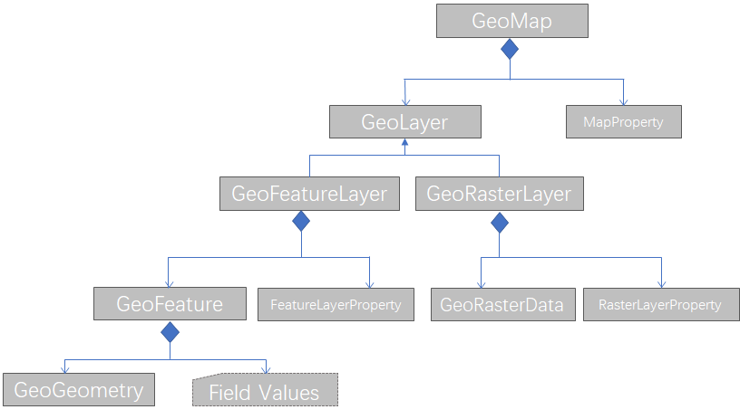

#### 3.3 OpenGL

封装VertexArray、VertexBuffer、IndexBuffer、Shader等类，同时抽象出LayerDescriptor、FeatureDescriptor等类，用于管理VAO、VBO、IBO与feature、layer的对应关系。每次读取一个个图层，就将数据一次性发送给GPU，同时使用LayerDescriptor和FeatureDescriptor记录VAO、VBO、IBO与feature、layer的对应关系。

对于TIFF栅格图像，使用OpenGL的贴图功能(Texture纹理)，首先在世界坐标系定位栅格图像四个顶点的位置，即一个矩形的位置，将TIFF图像贴到该矩形上即可。纹理过滤(Texture Filtering)方式应选择邻近过滤（GL_NEAREST）， 这样能产生颗粒状的图案，我们能够清晰看到组成图像的每个像素。

#### 3.4 空间索引

在本次实习中，暂时只实现了网格索引。每次读取图层后，自动创建网格索引。网格大小取图层中所有要素的最小外接矩形的平均大小的3倍。创建索引后，用户开始编辑后(右键图层->Edit Features->Start Editing)，即可点选或者拉框选择，释放鼠标后，被选中的要素会高亮边界。

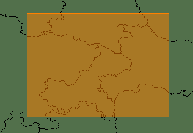

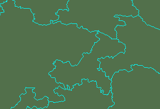

#### 3.5 核密度分析

在本次实习中，暂时只实现了点要素的核密度计算。点击工具箱的"Kernel Densigy"，弹出核密度计算工具，选择点图层后，会自动计算最优搜索半径（带宽）和推荐栅格大小，用户也可自行调整。输出为TIFF图像，存有地理位置信息。计算完成后，程序会询问是否导入地图中，点击OK即可导入地图，由于有经纬度信息，因此图像可以渲染到指定位置（地图支持矢量图层和栅格图层）。

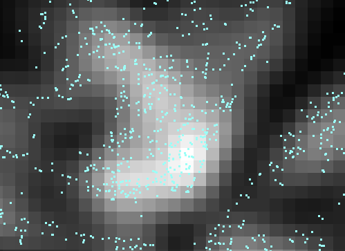

## 五、遇到的问题及解决方案

### 1、OpenGL平移、缩放图形

程序中使用了VBO、VAO、IBO等管理顶点的位置和颜色数据，发送给GPU的数据是世界坐标系下的坐标，需要经过Model、View和Project变换，将其转换为规范立方体中的坐标，即`-1 < x,y,z < 1`。然后再经过视口变换转换为窗口坐标。

投影可以选择正射投影和透`视投影。平移和缩放即可以通过改变Model矩阵，也可以通过改变View矩阵来实现。前者直接作用于模型，后者通过改变观察位置（摄像机位置）。透视投影可以产生近大远小的效果，即摄像机离物体越近，物体“看起来”越大，摄像机往左移动，物体(相对)往右移动。

在实习中，一开始使用的是透视投影，Model矩阵固定不变，Project基本不变，只需要改变View矩阵，即摄像机的前后左右上下移动，即可实现图形的缩放平移。

但是后来在做核密度分析时，加载了点要素，由于一个点相对于整个地图来说是十分小的(点的大小设为4），需要将地图不断放大才能将一团点要素分离开。而放大是通过将摄像机靠近物体来实现的，但是摄像机距离物体是有下限的（受限于浮点数的精度），即摄像机不可能无限靠近于物体，所以结果就是，一团点要素无法分离。

于是后来，改用了正射投影，正射投影无法产生近大远小的效果，必须通过Model矩阵变换来实现缩放平移(当然，平移也可以通过摄像机移动来实现，不过为了统一，只进行Model矩阵变换)。理论上，这种方式下，图形是可以无限放大的。效果可以参考上面的图。

### 2、属性表的存储

属性表是由一条条记录组成的。一个feature对应一条记录。但是，这一条记录中，既有int、double类型，又有QString等类型，该如何存储。

在实习中的解决方案是，首先使用GeoFieldDefn定义每一列(字段)，存储该字段的名称、类型和宽度。一个GeoFieldDefn的数组即为该属性表的表头。然后，对于每个feature而言，并不需要直接存储每一个字段的值，而是存储字段的值的指针，而且全都按void指针存储，这样，就能用一个数组管理。而需要取出指定字段的值时，先去该字段的定义那里确定该字段的类型，再将void指针强制转换为对应类型的指针。借助c++的模板函数功能，可以很简洁的实现设置字段值和获取字段值的函数。

## 六、Some Images

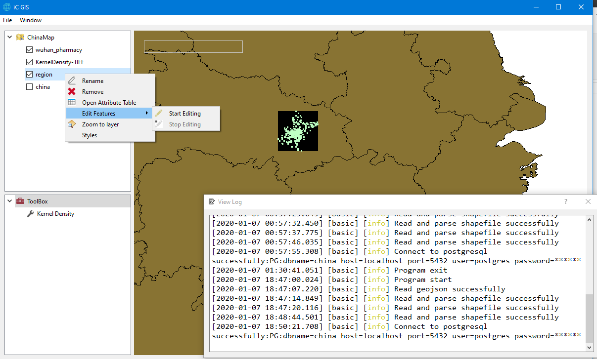

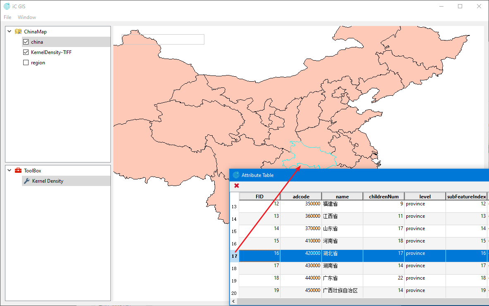

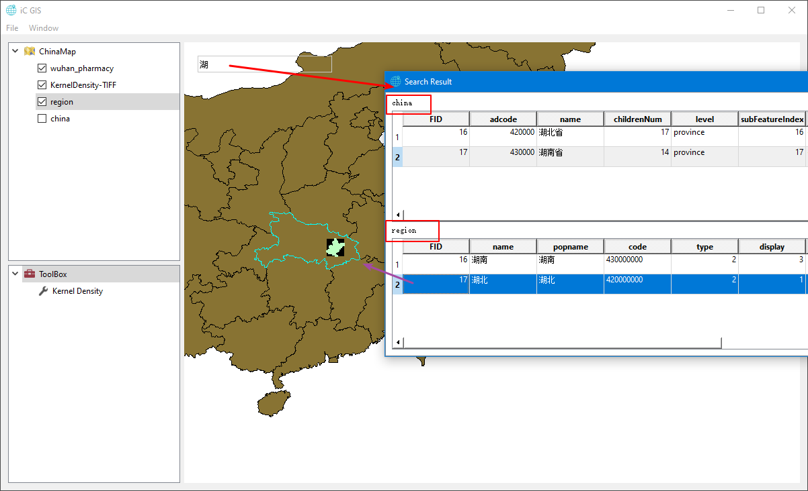

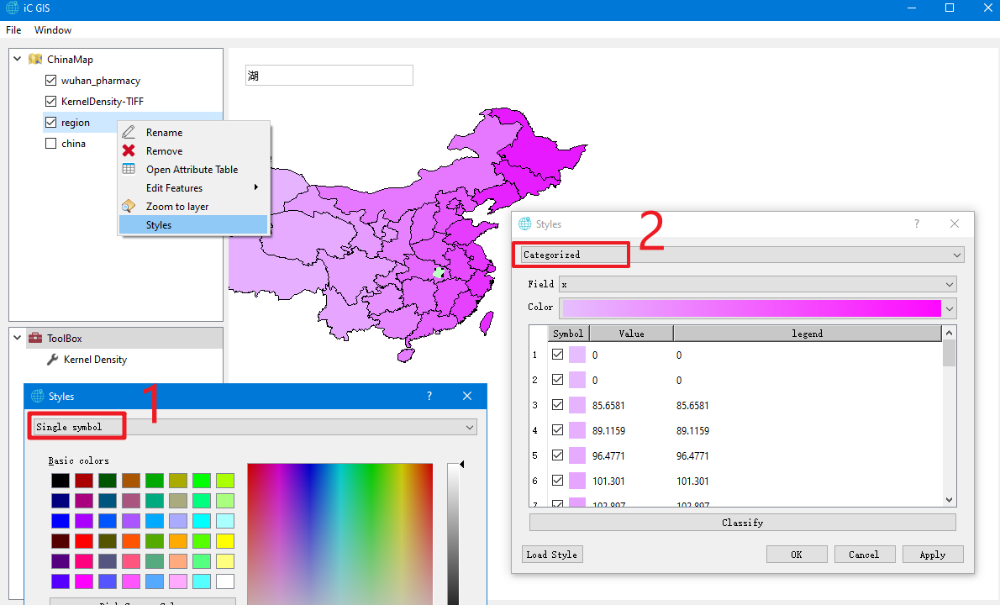

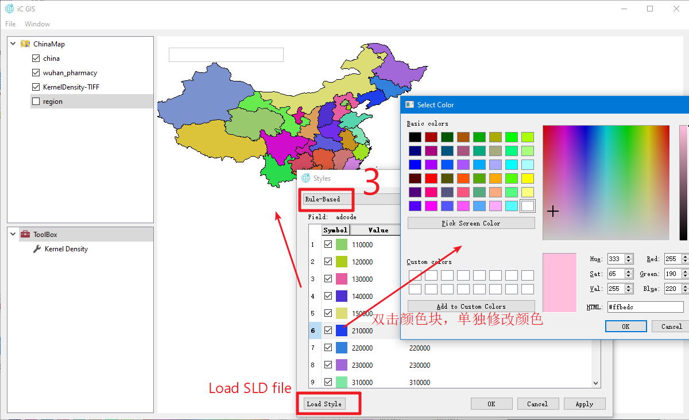

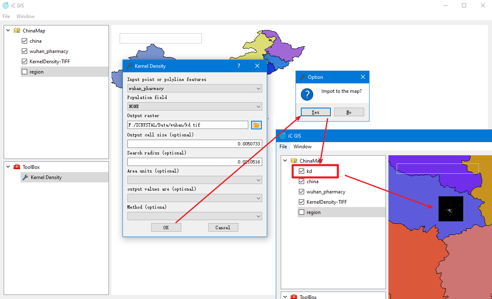

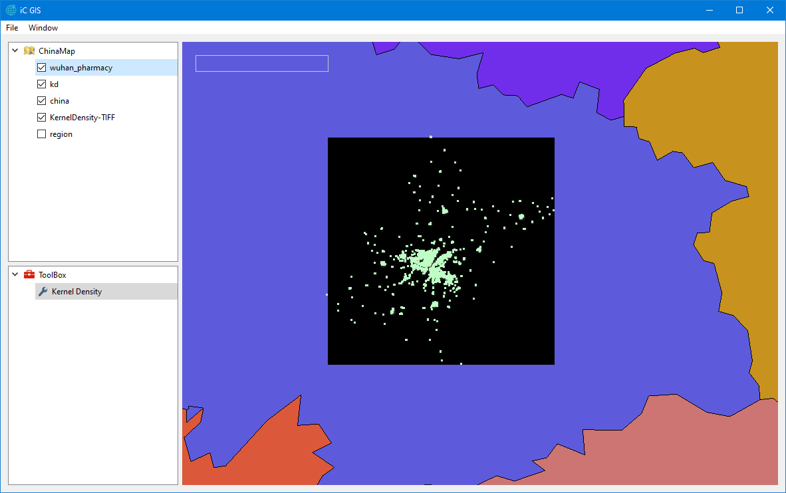

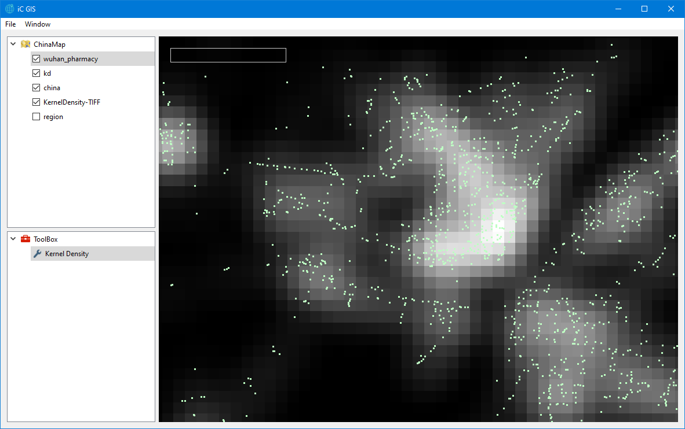
